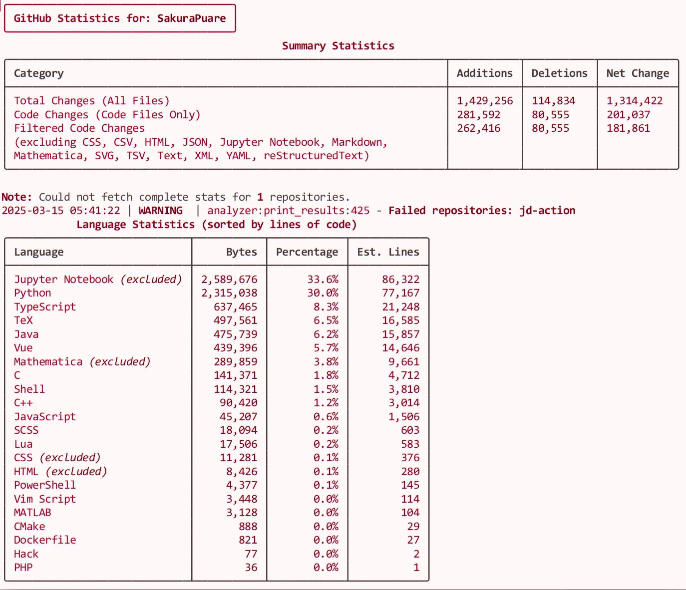
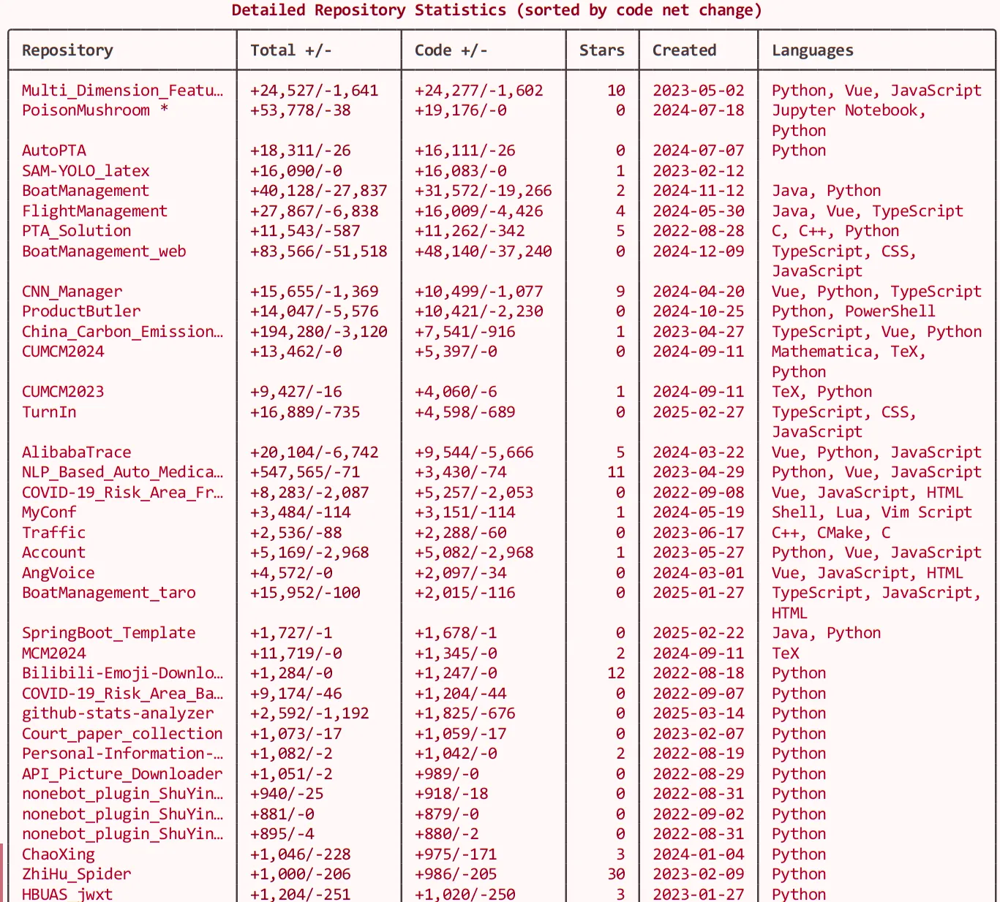

# GitHub User Statistics Analyzer 📊

[](https://www.python.org/downloads/)
[](https://opensource.org/licenses/MIT)
[](https://github.com/psf/black)

*Read this in [中文 (Chinese)](README_CN.md).*

This Python program analyzes a GitHub user's repositories to collect comprehensive statistics on:
- 📈 Total additions and deletions across all repositories
- 🔤 Lines of code per programming language
- 📚 Detailed repository information (ignoring forked repositories)




## ✨ Features

- **Comprehensive Analysis**: Collects detailed statistics on code contributions
- **Language Breakdown**: Shows distribution of code across programming languages
- **Excludes Forks**: Only analyzes original repositories, not forks
- **Parallel Processing**: Efficiently processes multiple repositories concurrently
- **Rich Output**: Beautiful console output with tables and colors
- **Detailed Logging**: Comprehensive logging for debugging

## 🔧 Requirements

- Python 3.7+
- GitHub Personal Access Token

## 📥 Installation

1. Clone this repository:
```bash
git clone https://github.com/SakuraPuare/github-stats-analyzer.git
cd github-stats-analyzer
```

2. Install the required dependencies:
```bash
pip install -r requirements.txt
```

3. Create a `.env` file in the project directory and add your GitHub Personal Access Token:
```
GITHUB_TOKEN=your_personal_access_token_here
```

### 🔑 How to get a GitHub Personal Access Token

1. Go to your GitHub account settings
2. Select "Developer settings" from the sidebar
3. Click on "Personal access tokens" and then "Tokens (classic)"
4. Click "Generate new token" and select "Generate new token (classic)"
5. Give your token a descriptive name
6. Select the following scopes: `repo`, `read:user`
7. Click "Generate token"
8. Copy the token and paste it in your `.env` file

## 🚀 Usage

Run the program with a GitHub username as an argument:

```bash
python main.py <github_username>
```

For example:
```bash
python main.py octocat
```

### ⚙️ Command Line Options

The program supports the following command line options:

```bash
python main.py <github_username> [--debug] [--include-all]
```

- `--debug`: Enable debug output for more detailed logging
- `--include-all`: Include all languages in statistics (don't exclude any)

## 🏗️ Project Structure

The project is organized into several modules:

| Module | Description |
|--------|-------------|
| `main.py` | Main entry point for the application |
| `analyzer.py` | Core analysis functionality |
| `api.py` | GitHub API client |
| `cli.py` | Command line interface |
| `config.py` | Configuration settings |
| `logger.py` | Logging configuration |
| `models.py` | Data models |
| `utils.py` | Utility functions |

## 📋 Output

The program will display:
- Total additions and deletions across all repositories
- Language statistics sorted by lines of code
- List of repositories with star count and creation date

## 📝 Notes

- The program ignores forked repositories
- GitHub API has rate limits, so analyzing users with many repositories might take time
- Lines of code are estimated based on byte count (approximation)
- Some languages are excluded by default to avoid skewing statistics (use `--include-all` to include them)
- Log files are stored in the `log` directory

## 🤝 Contributing

Contributions are welcome! Please feel free to submit a Pull Request.

## 📄 License

This project is licensed under the MIT License - see the LICENSE file for details.

---

Generated with ❤️ by [Cursor](https://cursor.sh)