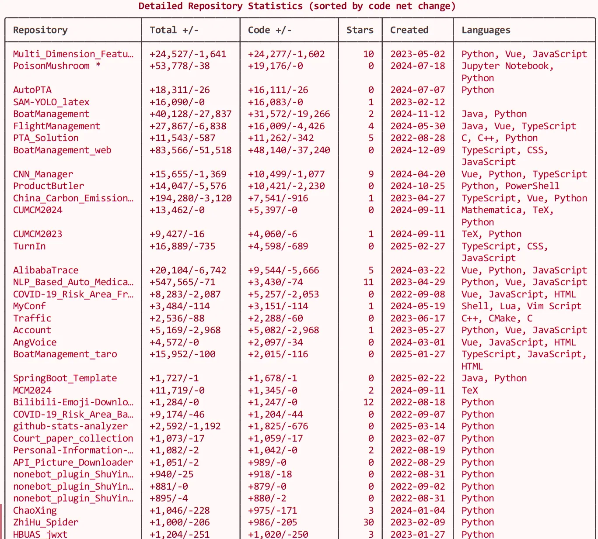

# GitHub 用户统计分析器 📊

[](https://www.python.org/downloads/)
[](https://opensource.org/licenses/MIT)
[](https://github.com/psf/black)
[](https://badge.fury.io/py/github-stats-analyzer)
[](https://pypi.org/project/github-stats-analyzer/)

*Read this in [English](README.md).*

这个Python程序分析GitHub用户的仓库，收集全面的统计数据，包括：
- 📈 所有仓库的总添加和删除行数（包括fork的仓库，但只统计用户自己的贡献）
- 🔤 每种编程语言的代码行数
- 📚 详细的仓库信息




## ✨ 特性

- **全面分析**：收集代码贡献的详细统计数据
- **语言细分**：显示代码在各编程语言中的分布
- **智能Fork分析**：分析所有仓库包括fork的仓库，但只统计用户自己的贡献
- **并行处理**：高效地并发处理多个仓库
- **丰富输出**：美观的控制台输出，带有表格和颜色
- **详细日志**：用于调试的全面日志记录

## 🔧 要求

- Python 3.7+
- GitHub 个人访问令牌（Personal Access Token）

## 📥 安装

### 通过 pip 安装（推荐）

```bash
pip install github-stats-analyzer
```

### 从源码安装

1. 克隆此仓库：
```bash
git clone https://github.com/SakuraPuare/github-stats-analyzer.git
cd github-stats-analyzer
```

2. 安装所需依赖：
```bash
pip install -r requirements.txt
```

3. 在工作目录中创建一个`.env`文件，并添加您的GitHub个人访问令牌：
```
GITHUB_TOKEN=your_personal_access_token_here
```

### 🔑 如何获取GitHub个人访问令牌

1. 进入您的GitHub账户设置
2. 从侧边栏选择"Developer settings"（开发者设置）
3. 点击"Personal access tokens"（个人访问令牌），然后选择"Tokens (classic)"
4. 点击"Generate new token"（生成新令牌）并选择"Generate new token (classic)"
5. 给您的令牌一个描述性名称
6. 选择以下权限范围：`repo`，`read:user`
7. 点击"Generate token"（生成令牌）
8. 复制令牌并粘贴到您的`.env`文件中

## 🚀 使用方法

### 命令行界面

安装后，您可以通过以下三种方式使用该工具：

1. 使用安装的命令：
```bash
github-stats <github_username>
```

2. 使用Python的-m参数：
```bash
python -m github_stats_analyzer <github_username>
```

3. 从源码运行：
```bash
python main.py <github_username>
```

### 命令行选项

程序支持以下命令行选项：

```bash
github-stats <github_username> [--debug] [--include-all]
```

- `--debug`：启用调试输出，获取更详细的日志
- `--include-all`：在统计中包含所有语言（不排除任何语言）

### Python API

您也可以在Python代码中将其作为库使用：

```python
import asyncio
from github_stats_analyzer import GitHubStatsAnalyzer

async def analyze_user(username: str):
    analyzer = GitHubStatsAnalyzer(username)
    await analyzer.analyze()
    analyzer.print_results()

# 运行分析
asyncio.run(analyze_user("octocat"))
```

## 🏗️ 项目结构

项目分为几个模块：

| 模块 | 描述 |
|--------|-------------|
| `main.py` | 应用程序的主入口点 |
| `analyzer.py` | 核心分析功能 |
| `api.py` | GitHub API客户端 |
| `cli.py` | 命令行接口 |
| `config.py` | 配置设置 |
| `logger.py` | 日志配置 |
| `models.py` | 数据模型 |
| `utils.py` | 实用函数 |

## 📋 输出

程序将显示：
- 所有仓库的总添加和删除行数
- 按代码行数排序的语言统计
- 仓库列表，包含星标数和创建日期

## 📝 注意事项

- 程序分析所有仓库包括fork的仓库，但只统计用户自己的贡献
- GitHub API有速率限制，因此分析拥有许多仓库的用户可能需要一些时间
- 代码行数是基于字节数的估计（近似值）
- 默认情况下排除某些语言以避免统计偏差（使用`--include-all`选项可包含所有语言）
- 日志文件存储在`log`目录中

## 🤝 贡献

欢迎贡献！请随时提交Pull Request。

## 📄 许可证

本项目采用MIT许可证 - 详情请参阅LICENSE文件。

---

由 [Cursor](https://cursor.sh) 生成 ❤️ 